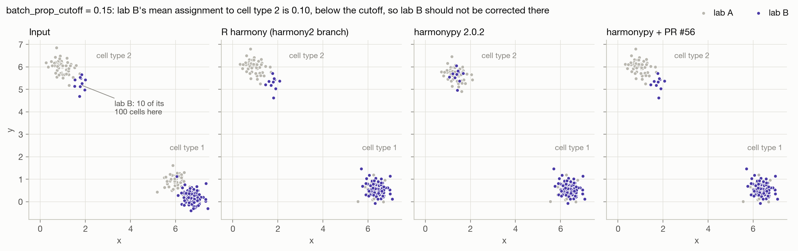
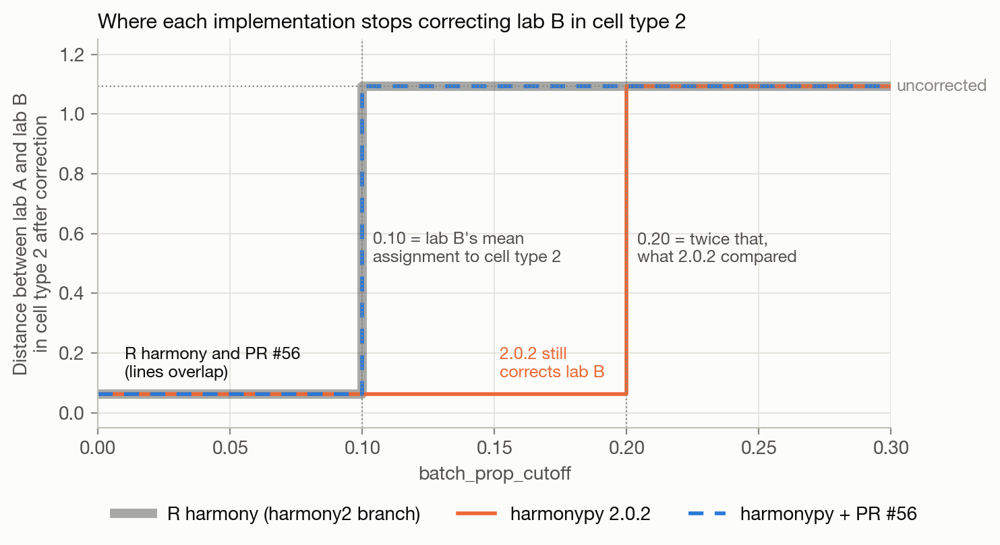
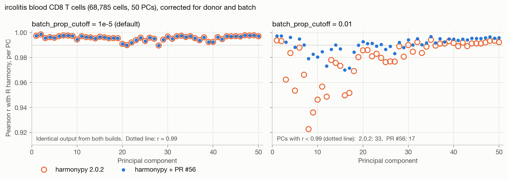

# PR #56: `batch_prop_cutoff` is checked against a doubled value

[PR #56](https://github.com/slowkow/harmonypy/pull/56) reports that harmonypy
corrects coordinates it should leave alone when `vars_use` has more than one
column. This folder checks that claim against R harmony and shows how the
fixed code behaves.

**The concern is valid.** harmonypy 2.0.0 through 2.0.2 depart from R harmony.
With `n` correction columns, harmonypy compares `n ×` the fraction of each
batch's cells assigned to a cluster against `batch_prop_cutoff`. In effect the
cutoff becomes `batch_prop_cutoff / n`. PR #56 restores R's behavior.

**Status:** merged into master as
[edb549c](https://github.com/slowkow/harmonypy/commit/edb549c0d100a12acbcc2f5871c11018d922d98d)
on 2026-10-02; not yet in a release.

- **Affected:** runs with two or more `vars_use` columns. With one column,
  `n = 1` and nothing changes.
- **Default cutoff (`1e-5`):** rarely affected. With two columns, only a
  (cluster, batch) pair whose mean assignment falls between 5e-6 and 1e-5 is
  treated differently. On a 68,785-cell dataset corrected for donor and batch,
  no pair fell in that range, and 2.0.2 and PR #56 give bit-identical output.
- **Larger cutoffs (such as the `0.01` in R's documentation):** materially
  affected. See [Real data](#real-data).

## The code

R harmony, [`harmony2` branch, `src/harmony.cpp`](https://github.com/immunogenomics/harmony/blob/83f3e8a68391d9a7374142e43656f4e034cc9d3e/src/harmony.cpp#L354-L404).
`Phi` is the one-hot matrix of all levels of all columns, so `sizes(b)` is the
number of cells in level `b`:

```cpp
VECTYPE sizes(sum(Phi, 1));                  // L354
...
VECTYPE avg_R(O.row(k).t() / sizes);         // L362: mean assignment of level b to cluster k
...
// L379-381: count the levels of each column that pass the cutoff
if (batch_representation > batch_proportion_cutoff) cov_levels[current_covariate]++;
...
// L401-402: correct level b in cluster k if it passes and another level of its column does too
if (batch_representation > batch_proportion_cutoff && cov_levels[current_covariate] > 1) keep.push_back(b);
```

harmonypy 2.0.2, `Harmony::build_batch_structures` in `src/harmony.cpp`:

```cpp
for (int c = 0; c < n_covariates; ++c)
    for (int j = 0; j < N; ++j)
        batch_sizes(batch_ids(c, j)) += 1.0f;   // already the full count per level
// Each cell is counted n_covariates times; normalize
batch_sizes /= static_cast<float>(n_covariates);  // then divides it by n (halves it with 2 columns)
```

The comment holds for the total over all levels, but each level belongs to only
one column, so each cell is counted once per level. Dividing by `n_covariates`
shrinks every level's size by `n`, which inflates `avg_R` by `n`. This came in
with [6cab78a](https://github.com/slowkow/harmonypy/commit/6cab78af3898c2b03a4a5ae83d319e4ebc68b2ba)
(first released in v2.0.0), which replaced `batch_sizes = sum(Phi, 1)` with
direct counting. `batch_sizes` is read in one place only: the `avg_R` line in
`moe_correct_ridge`. `O`, `E`, `Pr_b` and the clustering step don't read it, so
the bug changes only which levels are corrected in each cluster. Later
iterations cluster the corrected embedding, though, so the final assignments
can differ too.

PR #56 deletes the division.

## Minimal reproducer

[`minimal.py`](minimal.py) is the four-cell case from the PR. All four cells
point the same way after cosine normalization, so each cell is split 0.5 / 0.5
between the two clusters. Each lab and each day then has a mean assignment of
exactly 0.5. The cutoff is also 0.5, so no level exceeds it and nothing should
move:

```python
coords = np.array([[1.0], [2.0], [3.0], [4.0]])
meta = {"lab": ["a", "a", "b", "b"], "day": ["1", "2", "1", "2"]}
res = hm.run_harmony(coords, meta, ["lab", "day"], nclust=2, theta=0, lamb=1,
                     max_iter_harmony=1, max_iter_kmeans=1, batch_prop_cutoff=0.5)
```

| build | output | unchanged |
|---|---|---|
| harmonypy 2.0.2 | `[1.75 2.25 2.75 3.25]` | no: the check saw 1.0 > 0.5 |
| harmonypy + PR #56 | `[1. 2. 3. 4.]` | yes: the check saw 0.5, not > 0.5 |

R harmony can't run this case. It refuses fewer than 6 cells, and an 8-cell
version (every cell again identical after normalization) ran for over two
minutes without finishing. The toy example below covers the R comparison.

## Toy example, compared with R

[`make_toy_data.py`](make_toy_data.py) writes 200 cells in 2-D: two
well-separated cell types, with lab B shifted by (0.8, −0.8). Lab B has only
10 of its 100 cells in cell type 2, so its mean assignment to that cluster is
0.10. The same file goes to harmonypy
([`run_harmonypy.py`](run_harmonypy.py)) and to R harmony
([`run_r_harmony.R`](run_r_harmony.R)), with `vars_use = ["lab", "day"]`,
`nclust = 2`, `theta = 0` and `lambda = 1`.

At `batch_prop_cutoff = 0.15`, lab B is below the cutoff in cell type 2, so R
leaves lab B uncorrected there. harmonypy 2.0.2 sees 0.20, which is above the
cutoff, so it corrects lab B there, merging lab A and lab B in cell type 2.
PR #56 matches R.



Sweeping the cutoff shows the mechanism. R stops correcting lab B in cell type
2 once the cutoff reaches lab B's mean assignment (0.10). harmonypy 2.0.2 keeps
correcting until the cutoff reaches twice that (0.20). At every one of the 61
cutoffs, the remaining lab A/lab B distance with PR #56 is within 2 × 10⁻⁵ of
R's ([`results/toy_sweep_*.tsv`](results/)).



## Real data

This check uses the ircolitis blood CD8 T cells in the repository's top-level
[`data/`](../../data/) folder (68,785 cells, 50 PCs), corrected for `donor` (21 levels) and `batch` (11 levels) with default
settings (100 clusters). Each harmonypy build is compared with R harmony, PC
by PC.



| cutoff | build | min r with R | median r | PCs with r < 0.99 |
|---|---|---|---|---|
| 1e-5 (default) | harmonypy 2.0.2 | 0.9897 | 0.9962 | 2 |
| 1e-5 (default) | harmonypy + PR #56 | 0.9897 | 0.9962 | 2 |
| 0.01 | harmonypy 2.0.2 | 0.9226 | 0.9852 | 33 |
| 0.01 | harmonypy + PR #56 | 0.9700 | 0.9918 | 17 |

At cutoff 0.01, with PR #56's final assignments, 513 of the 2,100 (cluster,
donor) pairs and 266 of the 1,100 (cluster, batch) pairs have a mean
assignment between 0.005 and 0.01
([`results/ircolitis_levels_pr56.tsv`](results/ircolitis_levels_pr56.tsv)).
R's rule skips those pairs and 2.0.2's rule corrects them. In 2.0.2's own run
the counts are 753 and 488. With 100 clusters, a typical mean assignment is
about 1/100, which is right where the cutoff sits.

PR #56 still doesn't match R exactly at 0.01. Harmony in R and Python uses
different random k-means initializations, so small differences in assignments
remain even at the default cutoff. At 0.01 many levels sit near the cutoff, so
those small differences flip more include/exclude decisions. What the PR
removes is the systematic factor of two.

## Reproduce

```bash
./run_all.sh
```

This builds harmonypy at tag `v2.0.2` and at master commit `edb549c` (PR #56
as merged; same tree as the PR head `d2ef71c`) into throwaway virtualenvs. It
builds R harmony from the `harmony2` branch (commit `83f3e8a`, the one the PR
links), then runs everything and redraws the figures. Notes on the R build:

- The multi-column ridge step calls `inv()`, which needs LAPACK. Without it,
  every two-column run fails with `inv(): use of LAPACK must be enabled`.
- The `harmony2` configure script tests for LAPACK by compiling a call to
  `sgesv_` that passes integers where pointers are expected. Current compilers
  (Apple clang 17, GCC 14+) reject that, so configure turns LAPACK off even
  when it is available. On macOS, R's bundled LAPACK also lacks `sgesv_`.
- So the script skips configure and writes `src/Makevars` itself. On macOS it
  links Apple Accelerate. On Linux it links R's configured LAPACK and BLAS,
  which must provide `sgesv_`. Only the macOS path has been run.

| file | what it does |
|---|---|
| `minimal.py` | four-cell reproducer; `results/minimal_*.txt` has its output from each build |
| `make_toy_data.py` | writes `data/toy.tsv` |
| `run_harmonypy.py LABEL` | runs the installed harmonypy; writes `results/*_LABEL.*` |
| `run_r_harmony.R` | runs R harmony on the same inputs; writes `results/*_r_harmony.*` |
| `plot.py` | writes `figures/` and `results/ircolitis_correlation_with_r.tsv` |

The full ircolitis outputs (`results/*.tsv.gz`, 13 MB each from harmonypy and
29 MB each from R) are gitignored; `run_all.sh` regenerates them.
