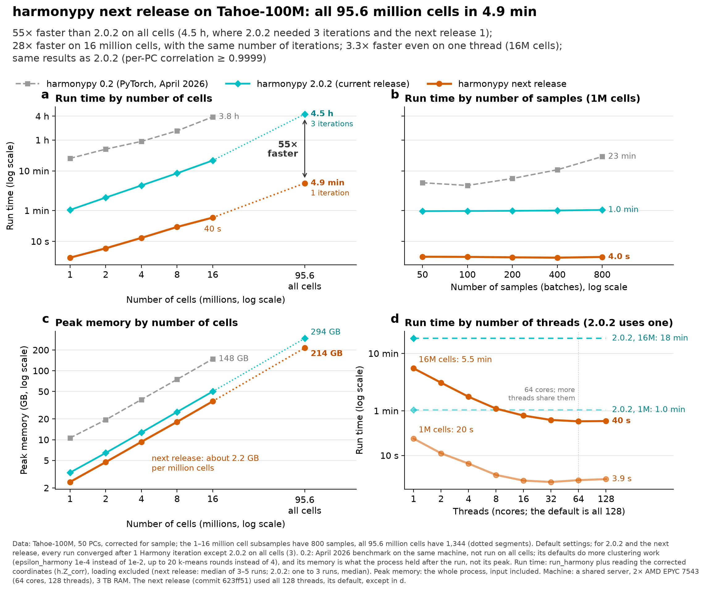

# harmonypy on Tahoe-100M: all 95.6 million cells in 4.9 minutes

This folder holds the run-time benchmark of harmonypy's C++ rewrite
([#58](https://github.com/slowkow/harmonypy/pull/58), commit 623ff51) against
the 2.0.2 release on the Tahoe-100M dataset: 50 PCs of 95,596,109 cells from
1,344 samples, and subsamples of 1 to 16 million cells. It ran on
2026-10-04 on a shared server (2× AMD EPYC 7543, 64 cores, 3 TB RAM).



| Cells | Samples | 2.0.2 | Next release | Faster | Peak memory, 2.0.2 → next | Iterations, 2.0.2 / next |
|---|---:|---:|---:|---:|---:|---:|
| 1 million | 800 | 1.0 min | 3.9 s | 16× | 3.3 → 2.4 GB | 1 / 1 |
| 16 million | 800 | 18 min | 40 s | 28× | 50 → 36 GB | 1 / 1 |
| All 95.6 million | 1,344 | 4.5 h | 4.9 min | 55× | 294 → 214 GB | 3 / 1 |

- On the full dataset, 2.0.2 ran 3 Harmony iterations and the next release 1,
  so the 55× includes 2.0.2's extra iterations. The two builds use the same
  convergence rule, but 2.0.2 sums the objective in single precision, which
  on large inputs can change when it stops. With the same number of
  iterations (1 and 16 million cells) the next release is 16-28× faster, and
  3.3× faster even on one thread.
- The corrected coordinates agree with 2.0.2's: on 1 and 16 million cells,
  each PC's correlation differs from 1 by less than 1e-9.
- Peak memory is about 2.2 GB per million cells, 26-28% less than 2.0.2.
- Past 16 to 32 threads the gain is small. On 16 million cells, 16 threads
  took 50 s against 40 s with all 128, using a third of the CPU time.
- The number of samples hardly matters: 1 million cells with 50 to 800
  samples all take about 4 s.
- Encoding the sample labels took 1.5 min of the 3.8 min full run, because
  `np.unique` sorts every label. Replacing it with a hash table
  (`results-factorize.jsonl`, measured with `pandas.factorize`) brought the
  full run to 2.7 min with identical results. harmonypy now does this
  without pandas ([#59](https://github.com/slowkow/harmonypy/pull/59)), and
  its default `ncores` is one thread per physical core.

[benchmark-2026-10-summary.md](benchmark-2026-10-summary.md) has every
configuration: the samples, cells and threads sweeps, forced iterations,
0.2's settings, CPU pinning, and the agreement with 2.0.2.

## Files

- `benchmark-2026-10.png`, `.pdf`: the figure. `benchmark-2026-10-summary.md`:
  the tables.
- `results.jsonl`: one JSON line per run (132 runs). Each records the build,
  dataset, settings, threads, wall and CPU time, the time inside the C++
  backend, the Harmony iterations, peak memory, the CPU time other users took
  during the run, and the machine's state.
- `results-factorize.jsonl`: the label-encoding comparison (18 runs).
- `harmonypy-0.2-april-2026.json`: harmonypy 0.2.0 (the PyTorch version) on
  the same subsamples in April 2026, drawn in grey on the figure. Its
  defaults did more clustering work (`epsilon_harmony` 1e-4 instead of 1e-2,
  up to 20 k-means rounds instead of 4), and its memory is what the process
  held after the run, not its peak.
- `bench.py`: runs one configuration in its own process and appends a line to
  the results. Run time is `run_harmony` plus reading `h.Z_corr`, with
  loading excluded. Peak memory is the whole process, input included.
- `run.sh`: every configuration, in stages (`core`, `main-full`, `extra`,
  `old-full`); about 7.5 hours, 4.5 of them 2.0.2 on all cells.
  `factorize.sh`: the label-encoding comparison.
- `plot.py`: draws the figure and writes the summary from the results. Every
  number on the figure is computed from the data.
- `run-log.txt`, `factorize-log.txt`: the order and timing of the runs.

Not in the repo: the Tahoe-100M PCs and metadata (`pca.h5`,
`meta-aligned.parquet` and the `subsample/` files, hundreds of GB), the
corrected coordinates that `run.sh` saves in `Z/` (6.4 GB, used for the
agreement section of the summary), and the two virtual environments.

## Running it again

```bash
cd notebooks/tahoe-100m-benchmark
uv run --with matplotlib --with numpy python plot.py   # redraw the figure from results.jsonl
```

To rerun the benchmark you need the data, pointed to by `TAHOE_DATA`
(`pca.h5` and `meta-aligned.parquet` for all cells; `subsample/pca-1M.h5`
and `meta-1M.parquet` and so on for the subsamples), plus two environments
with h5py and pandas: `venv-main` with the build under test and `venv-2.0.2`
with harmonypy 2.0.2 from PyPI.

```bash
export TAHOE_DATA=/path/to/tahoe-ilya
uv venv venv-main -p 3.12 && uv pip install --python venv-main/bin/python harmonypy h5py pandas pyarrow
uv venv venv-2.0.2 -p 3.12 && uv pip install --python venv-2.0.2/bin/python harmonypy==2.0.2 h5py pandas pyarrow
setsid -f nohup ./run.sh > run.log 2>&1 < /dev/null   # all stages, about 7.5 hours
./run.sh core                                          # or one stage
```

To benchmark another build, make a venv with its wheel, add a `--build` label
for it in `run.sh`, and set `MAIN` in `plot.py`. Set `NEXT_LABEL` (for
example `NEXT_LABEL=2.1.0`) once the version number is chosen, so the figure
names it.
